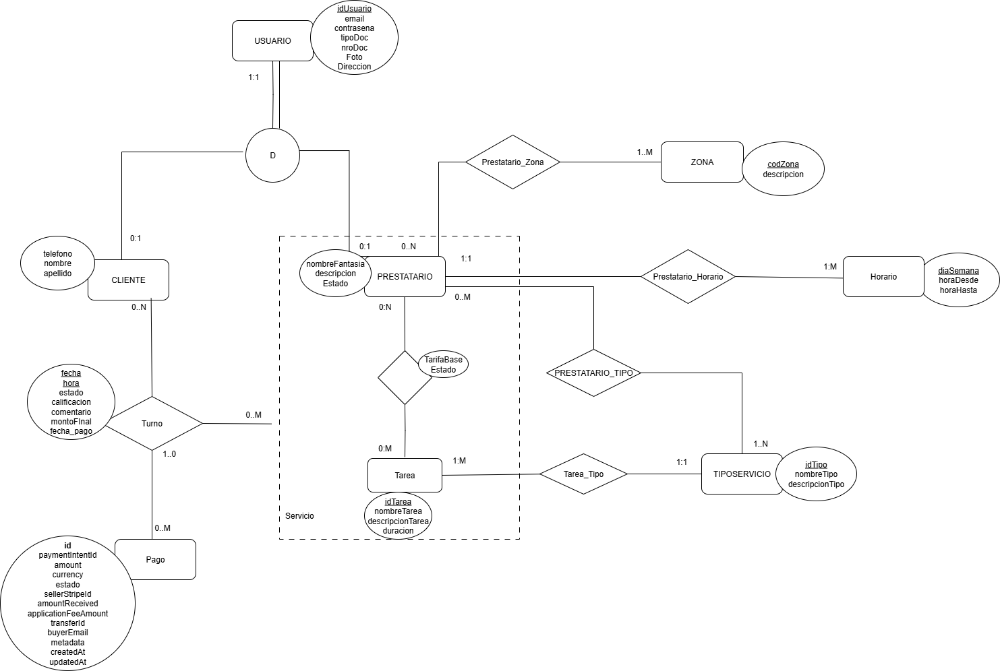

# Reformix App

Bienvenidos al proyecto Reformix. La idea detrás de este proyecto es brindar una plataforma para que los jóvenes
y los no tan jóvenes también puedan contratar a profesionales para que los ayuden con tareas de las que uno generalmente
no tiene idea, como **PLOMERÍA**. Esto facilitaría el proceso que uno hace de preguntarle a todos los conocidos
si sabe de alguien que haga esto de manera honesta.

Por el otro lado, el de los **plomeros** ya que venimos con el ejemplo, les ayudaría a conectar con mucha
más gente con la que de otra forma no podría trabajar. Ya que seamos realistas, es muy dificil encontrar a un
plomero donde sea que vivas.

La plataforma web cuenta con dos tipos de usuarios, los **Clientes** y los **Prestatarios**. Se puede observar claramente el
esquema planteado en nuestro 

Para más información acerca del proyecto, los invitamos a que lean nuestra [Documentación](docs/README.md)
